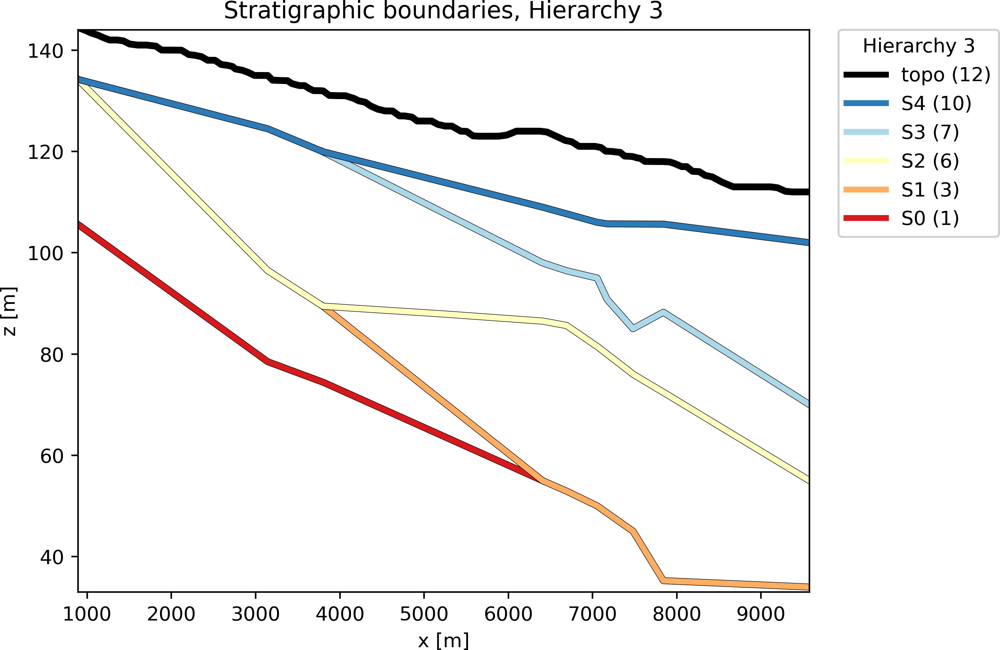
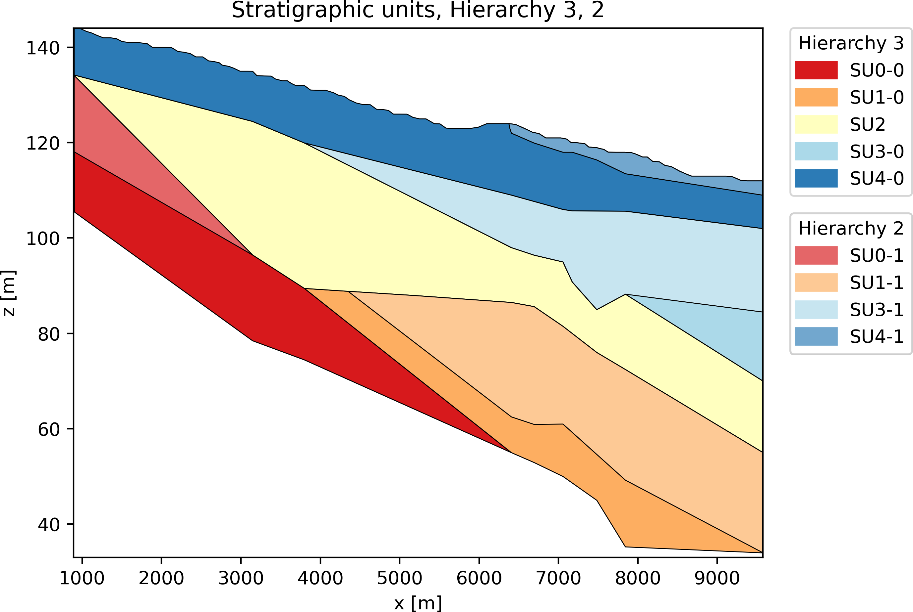
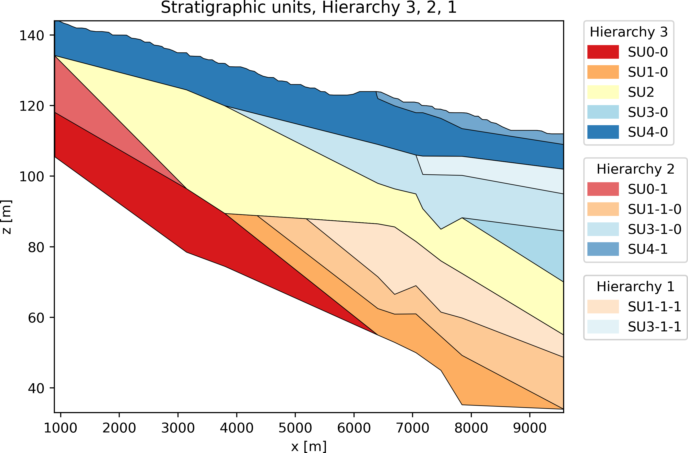

Purpose
=================

The purpose of the `hiegeo` Python module is to illustrate the
conceptualization of a novel approach to geological modeling, that
takes into account for the hierarchy and the chronological order of
the geological structures to be represented. It is not intended to
replace any existing state of art geological modeling tool. Instead,
it could be an useful tool to illustrate and demonstrate some clear
modeling guidelines for hierarchical structures, which could be then
implemented in more sophisticated tools.

See the manuscript "A new perspective to model subsurface stratigraphy
in alluvial hydrogeological basins, introducing geological hierarchy
and relative chronology" (Computers and Geosciences,
*accepted*) by Chiara Zuffetti, Alessandro Comunian, Riccardo
Bersezio, and Philippe Renard for more details.

Hereinafter you can see one of the possible output provided by
`hiegeo`, for example a representation of the geology in terms of
stratigraphic boundaries (SBs) including only the 3rd level of
hierarchy, the 3rd and the 2nd, and 3rd, 2nd and 1st:

The same representation at different hierarchical levels can be
obtained in terms of Stratigraphic Units (SUs):

In addition, you can also have a representation of the geological hierarchy as a tree structure:

|        topo
|        S4
|        └── S4-1
|        S3
|        └── S3-1
|            └── S3-1-1
|        S2
|        S1
|        └── S1-1
|            └── S1-1-1
|        S0
|        └── S0-1
