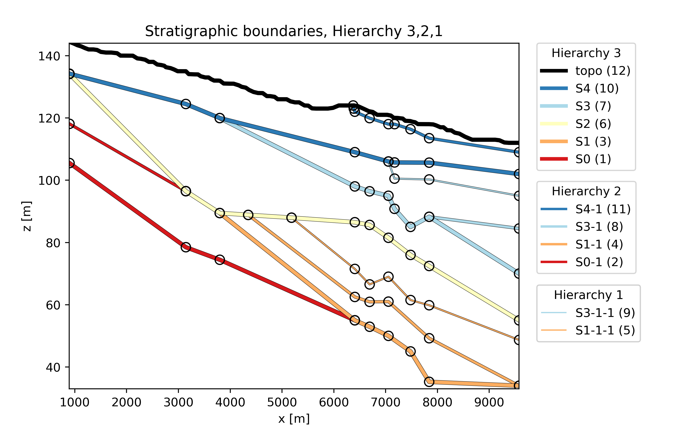

Usage
============
This section describe an example usage of `hiegeo`.

Input files
*******************

For properly run `hiegeo`, you need two files:

1) A `.JSON` file, that contains info about the discretization grid
   and the rendering of the plots.

2) A data file (`.CSV` format) that include the actual data set, with
   information about the contact points, chronology and hierarchy.

JSON file
------------------

An example `JSON` file is provided in the file ``examples/hiegeo_test.json``. It contains three main sections:

colors
    This section contains the definition (HEX format) of the color that should be given to each SB.
    The color should be provided for the highest hierarchy SBs only.
data_file
    The name of the CSV data file containing the data-set itself.
grid
    Info about the grid used to discretize the domain. The notation should be straightforward.

CSV file
----------------------------

This file contains all the required information to create and plot SBs and SUs.

Its header should look like:

|    ,gis_id,chronology,hierarchy,sb_name,su_name,x,z
|    0,1,10,3,S4,LCN,897.1953,134.202585
|    1,2,10,3,S4,LCN,3142.7824,124.47562
|    2,3,10,3,S4,LCN,3797.4044,119.94562
|    ...

Apart from the very first column, that contains some index that are
used by the Python library ``pandas`` (but here they could be set to
whatever), the other columns content should be:

gis_id
    This is simply a legacy column that contains the ID of the points extracted from the GIS software.
    You can set whatever value here as these are not used by `hiegeo`.
chronology
    This is a very important column since it contains information about the chronology of the corresponding
    SB. The value should be an integer, that grows from the oldest to the youngest SB.
hierarchy
    Another very important column, contains the hierarchy (sometimes called "rank") of the SB. High level of hierarchy
    means high importance in sedimentary terms. In the provided example we have integer values ranging from 1 to 3.
sb_name
    This is the name to be given to the SB. It should be a string
su_name
    This is the name of the SU. Actually, this column is not implemented and the SU is named according to
    and internally consistent nomenclature.
x
    The coordinate along the :math:`x` axis of the (contact) points
y
    The coordinate along the :math:`y` axis of the (contact) points
    
The following picture provides an illustration of the (subsurface)
points contained in the data-set used for demonstrating the working
principle of `hiegeo`.

	 
	 
Example scripts
**********************

Here two example scripts are provided in the `examples` folder. One file
(`hiegeo_test-simple.py`) contains a full working example to read
data, plot with a basic layout SBs and SUs, and provide a hierarchical
representation of the geology with a tree structure. The other file,
instead (`hiegeo_test-full.py`) provides a more complete example where
plots are made for three different levels of hierarchical
representation, with advanced plot legend and includes the creation of
a GSLIB output file.

Both script should be sufficiently documented to allow running them
without additional information.

You can move to the folder ``examples`` and there, from
the command line, run one of the two provided demonstration scripts.
For example::

  ./hiegeo_test-simple.py

and hit <Enter>.
On Linux you will probably need to give execution rights to the file, like this::

  chmod +x hiegeo_test-simple.py
